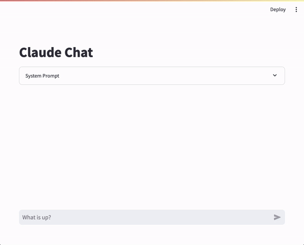

# Amazon Bedrock Chat (Python) 

This is "from-first-principles" code for performing chat flows with generative AI models from Amazon Bedrock. The code here is intended as an exploration of techniques to interact with Amazon Bedrock models, and code to help test other concepts such as agents, tools and function calling. 

The repo includes __Python class__ files that support chat, and some __sample client implementations__.

Currently this code only supports Anthropi Claude models via Amazon Bedrock.



## Description

The main focus of this repo is the `Chat()` Python class which handles all(?) the logic required to create a chat based application. Supported: Text prompting, text and image prompting, text generation, and text streaming generation.

## Getting Started

### Dependencies

```
# For class files:
boto3==1.28.59
botocore==1.31.85
pydantic==2.6.3
pydantic_core==2.16.3

# For clients:
streamlit==1.32.0
streamlit-chat==0.1.1
```

### Installing

* Clone repo
```
pip install -r requirements.txt
```

### Executing program

* To run the streamlit sample app:
    * Ensure you have AWS credentials accessible in the environment.

```
streamlit run ./demo_ui_chat_stream.py
```

## Authors

 - [Mike G Chambers](https://linkedin.com/in/mikegchambers)

## Version History

* 0.1
    * Initial Release

## License

This project is licensed under the MIT License - see the LICENSE.md file for details

## Disclaimer

This is a proof of concept. It is not intended to be used in production.